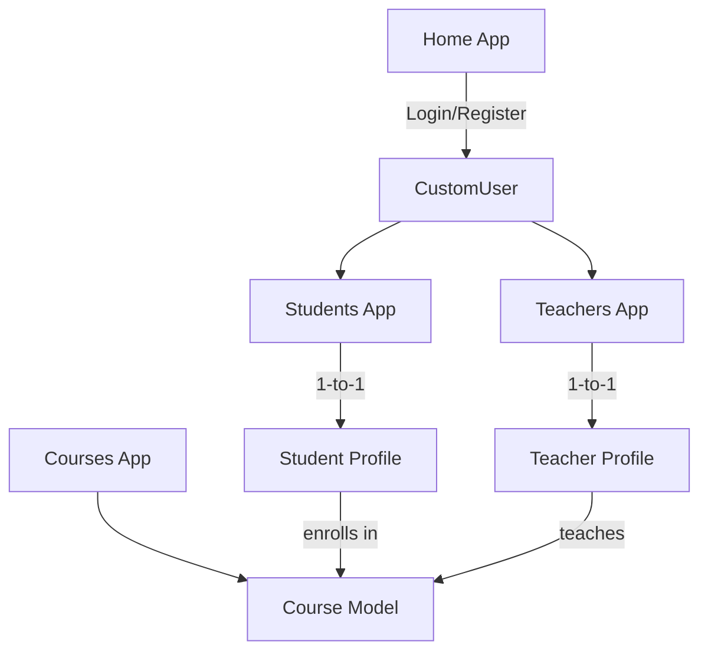

# Django Project Plan: Online School

## 1. Project Setup

- Create a new Django project named `onlineschool`.
- Create the `students`, `teachers`, `courses`, and `home` apps.

## 2. Custom User Model

- Define a custom user model in the `home` app, extending `AbstractUser`.
- Include a `role` field with choices for `student`, `teacher`, and `admin`.
- Set `AUTH_USER_MODEL` in `settings.py`.

## 3. Students App

- Create a `Student` model with a one-to-one relationship to the custom user model.
- Create views for listing and viewing students.
- Create templates for listing and viewing students.
- Register the `Student` model in the admin site.
- Set up URLs for the students app with namespace `students`.

## 4. Teachers App

- Create a `Teacher` model with a one-to-one relationship to the custom user model.
- Create views for listing and viewing teachers.
- Create templates for listing and viewing teachers.
- Register the `Teacher` model in the admin site.
- Set up URLs for the teachers app with namespace `teachers`.

## 5. Courses App

- Create a `Course` model with fields like `title`, `description`, and `schedule`.
- Create views for listing and viewing courses.
- Create templates for listing and viewing courses.
- Register the `Course` model in the admin site.
- Set up URLs for the courses app with namespace `courses`.

## 6. Home App

- Create `CustomUserCreationForm` and `CustomAuthenticationForm`.
- Create views for login and registration.
- Create templates for login and registration.
- Set up URLs for the home app.

## 7. Base Template

- Create a base template with navigation links to each app.
- Extend this template in all other templates.

## 8. Settings

- Configure the database settings in `settings.py`.
- Configure the template settings in `settings.py`.
- Configure the static files settings in `settings.py`.

## 9. URLs

- Set up the project-level URLs to include the app-level URLs.

## 10. Middleware (Optional)

- Implement middleware for role-based redirects.

## Project Structure Diagram

